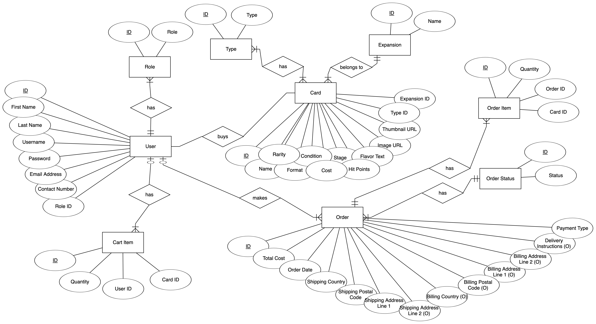
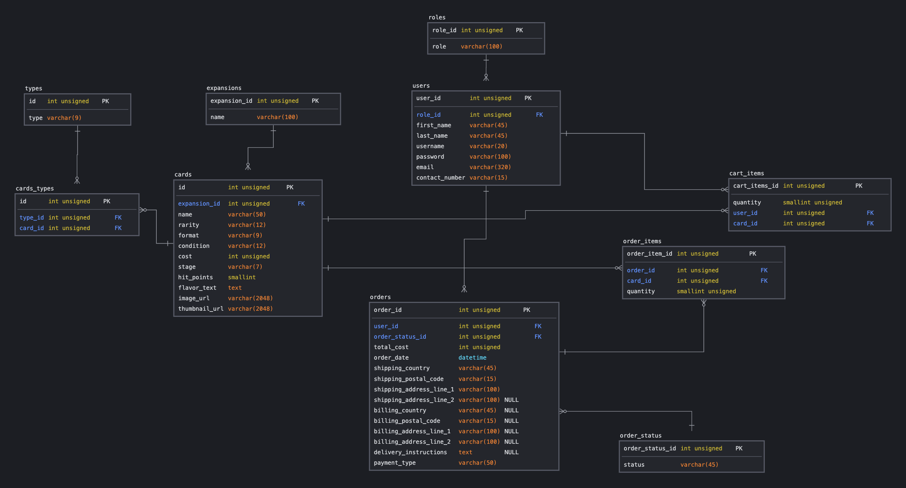

# Poké Port

Live link to demo: [Poké Port](https://poke-port.netlify.app/)

## Project Summary

Welcome to PokePort, a one-stop destination for all your Pokémon card needs! We've created this unique online platform with one clear mission in mind - to make buying Pokémon cards as easy, fun, and accessible as possible for enthusiasts worldwide.

### Target Audience & User Goals

## User Stories and Pain Points

A Pokémon card enthusiast lives in a remote area with no access to local game shops. PokePort allows him to explore a vast catalogue of cards and purchase them conveniently from the comfort of his home.

A mother wants to surprise her child with a rare Pokémon card for his birthday but has no idea where to start. PokePort's user-friendly interface and comprehensive search functions enable her to find the perfect card, and the community section helps her understand the value and significance of the card she is buying.

A seasoned collector is seeking to purchase a highly sought-after limited edition card. With PokePort's robust security measures, he can make his purchase with confidence, knowing that the card is authentic and his transaction is secure.

## UI/UX Elements

My SQL database was meticulously planned for, and the reflection of that planning can be found in my ERD Diagram and Logical Schema diagram.

---

## Features
| Features | Description |
| ----------- | ----------- |
| Mobile Responsiveness | The site adapts to various breakpoints with good layout for accessibility on computers and phones. |
| Database Integration | SQL Database stores all of the data for every detail related to the product — in this case, Pokémon cards. This includes card types, card prices, and card expansions. All user authentication data is accessed from this database as well. |
| Product Listings | All products in the store are able to be displayed. |
| Shopping Cart | Items can be added to the shopping cart, and paid for. |
| Secure Payment Gateway | Users can pay knowing they are doing so securely. |
| Order Tracking with Statuses | There is functionality to allow for orders to be tracked. |
| Search Functionality | Searching can be done to filter things. |
| Routing | The website redirects to different URLs to do what it needs to do. |

---

## Limitations and Future Implementations

Some possible features I would like to implement in the future are:
- Trading system: trade with others
- Favorites collection: players can save their favorite cards
- Linkage with any Pokémon APIs

---

## Tech Stack

- **FrontEnd**:

- **BackEnd**: 

--- 

## Testing

---

## Deployment

### Front-End
The web application is hosted on and was deployed through [Netlify](https://www.netlify.com/), directly from this GitHub repository.

### Back-End
The Express server is hosted on and was deployed through [Render](https://render.com/), directly from the main branch of [this GitHub repository](https://github.com/shiv-iyer/Project-3-BackEnd).

---

## Credits and Acknowledgment

Thank you so much to my lecturer, Paul, my friend, Isaac, as well as my classmates for help, guidance and support throughout this project.